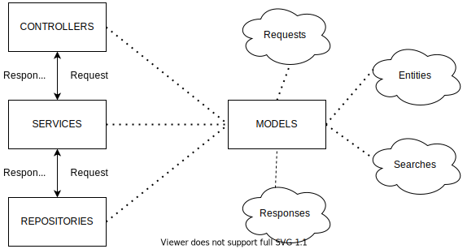

# Spring Boot Starter Abstraction

Provide abstractions for any projects that needs CRUD features

Primary goals:

- Enhance project init time with less coding but still maintain the ability to implement business logic (Server Layer)
- Provide the ability to customize response memory foot-print from frontend client side all the way to database and back
- Utilize springdoc for easy yet precise api documentation

# Installation

You can now get the dependency from maven central:

```xml
<dependency>
    <groupId>io.github.voduku</groupId>
    <artifactId>spring-boot-starter-abstraction</artifactId>
    <version><!-- LATEST_VERSION --></version>
</dependency>
```

# Project Structure



Following this diagram, all models will be shared between controllers, services and repositories.

There are quite some docs to read so take your time:
    - [Models](./src/main/java/io/github/voduku/model/README.md)
    - [Controllers](./src/main/java/io/github/voduku/controller/README.md)
    - [Services](./src/main/java/io/github/voduku/service/README.md)
    - [Repositories](./src/main/java/io/github/voduku/repository/README.md)
    - [Srpingdoc](./src/main/java/io/github/voduku/springdoc/README.md)
